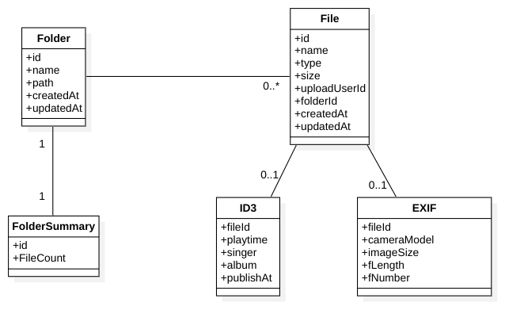

# Chapter 2: 서비스를 개발해 볼까?

## 무엇을 해야하지?

 "핸드폰에서 사진을 찍으면 자동으로 업로드 되고, 이를 다른 기기에서도 볼 수 있는 온라인 스토리지 서비스를 만들어보자" 라는 요구사항이 있습니다.

 이런 초기 아이디어를 통해, 비즈니스를 원하는 Sponsor가 서비스를 만들기로 결정했습니다. 이제 이 서비스를 개발하기 위해 어떤 것들을 준비해야 할까요?

### 1. 비즈니스를 이해하고, 비즈니스를 위한 모델을 만들어야 합니다.

 초기 Concept으로 기획부서에서 기능들을 다음가 같이 정의 했습니다.

```
서비스의 핵심 기능

  1. 사진을 찍으면 자동으로 업로드
  2. 일반 파일도 업로드 할 수 있어야 함
  3. 핸드폰에서 업로드 한 내용을, Web에서 볼 수 있어야 함
  4. 용량은 1GB까지 제공
```

또 이와 함께 작성된 UX 디자인 시안을 통해 다음과 같은 기능들을 클라이언트 개발부서에서 도출하였습니다.

```
UX 에 필요한 요구사항

  1. 사진을 클릭하면 사진정보를 볼수 있어야 함
  2. 음악파일의 경우 음원정보를 볼 수 있어야 함
  3. 폴더내의 사진들만 목록으로 보여줄 수 있어야 함
  4. 폴더내 음원파일들을 재생할때 자동으로 다음 음원파일이 재생 되어야 함
  5. 사용자의 모든 사진파일들의 목록을 볼 수 있는 화면이 필요함
      1. 해당화면에 페이징 기능이 제공되어야 함
      2. 사진에 포함된 메타정보(EXIF)를 함께 노출해야 함
      3. PC Web의 경우 사진의 실제 폴더위치를 함께 노출 해야 함 (추후 Folder테이블 Join으로 인한 성능이슈를 설명해야한다.)
      4. 사진이 있는 폴더목록들만 노출 할 수 있어야 함 (추후 Folder테이블 Join으로 인한 성능이슈를 설명해야한다.)
  6. 사용자의 모든 음악파일들의 목록을 볼 수 있는 화면이 필요함
      1. 해당화면에 페이징 기능이 제공 되어야 함
      2. 음악파일 조회시 메타정보(ID3) 정보를 함께 노출해야 함
      3. 음원파일을 폴더명 기준으로 정렬할 수 있어야 함
      4. 음원파일을 ID3의 가수명으로 정렬할 수 있어야 함
```

이전세대의 웹서비스 개발은 Backend서버 개발자들이 먼저 분석/설계를 진행하기도 하였습니다. 과거의 환경은 클라이언트의 종류도 다양하지 않았고, FrontEnd를 작성하는 기술들도 많지 않았습니다. 이 시절에는 JSP등의 서버페이지를 통해 클라이언트 작성을 했던 시대 였고, 서버 개발자와 클라이언트 개발자의 경계가 확실히 자리잡기 이전이었습니다.

서비스의 초기 기획 단계에서는 Backend 개발자보도 기획자와 클라이언트 개발자의 역할이 중요합니다.

이

과거에 사용하던 데이터모델의 경우 이미 많이 사용된 만큼 개발자가 아니더라도 ERD를 어느정도 이해 할 수 있습니다. 


## 데이터 모델

