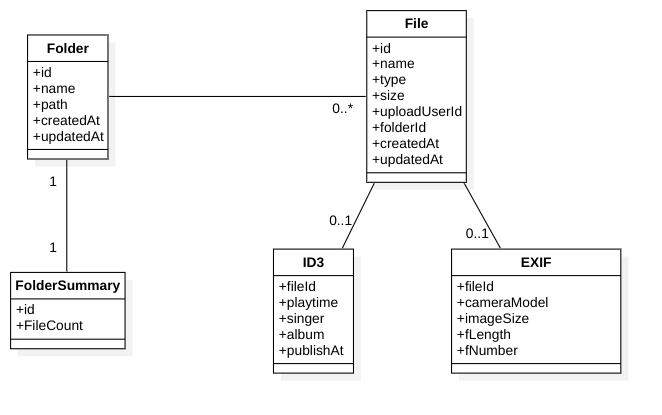

# Chapter 03 - 통합 데이터모델

 Command Model과 Query Model은 다른 Domain Model을 사용합니다. 

 Command Model은 비즈니스 관점에서 Domain Object를 생성, 변경, 삭제하는 Interaction 기능을 맡습니다. 반면, Query Model은 사용자가 정보를 이해하기 쉽게 표현하는 목적을 가지고 설계되었습니다.

 UX에서 보면, 사용자의 개인정보 변경, 파일 업로드, 데이터 Processing 등은 Command Model에 해당하고, 정보 표현, 목록 표현 등은 Query Model에 해당합니다.

 따라서 Command Model과 Query Model은 목적과 Processing 로직이 다릅니다.

## 통합 모델 중심의 과거의 서비스들의 문제점

 IT에서는 통합 데이터 모델이 오랫동안 사용되었습니다.

 통합모델은 하나의 통합된 Data Model로 Domain Object의 CRUD(Create, Read, Update, Delete) 작업을 수행하며, 시스템 구조가 단순해서 규모가 작은 서비스 초기에는 관련인력들이 이해하기 쉽습니다.

그러나, 비즈니스가 지속되면서 다음과 같은 문제가 발생합니다.

### 비즈니스 확장 지연

 하나의 Domain Model을 사용하기 때문에, Command Model이 변경되면 Query Model도 변경됩니다.

 그러나 하나의 Model을 공유하지 않더라도 대부분의 경우에서 비즈니스 목적상 모두 변경해야 하기 때문에, 큰 문제는 아닐 수 있습니다. 조직적으로 살펴보면 UX가 변경될 때에는 Backend 서버 Application도 변경되어야 하기 때문에, 각 담당자 간의 Communication 과 Scheduling 등의 조직적인 문제가 발생할 수 있습니다.  이러한 과도한 조직간의 문제가 비즈니스 확장을 위한 기능 개발의 확장을 지연시킵니다.

### 검토, 검토, 검토

 Domain Model의 변경 관리는 시스템의 진화에 따라 중요해지며, 관계자들은 충분히 Command Model과 Query Model을 이해해야 합니다. 

 비즈니스 기능이 늘어날수록 복잡성이 증가하여 관계자들이 검토해야 할 것이 많아질 수 있지만, 이를 회피하거나 검토하고 있는 것이 자주 발견되면 이미 관계자들의 이해 수준에 큰 차이가 발생했음을 알 수 있습니다.

 모 통합모델을 사용하는 서비스는  성능 중심(화면의 표현이 쉽지 않다거나) 의 이슈가 발생하기 시작하고, 연달아 조직적인 문제로 확산되는 것을 볼 수 있습니다.

## 통합모델 기반의 파일 관리서비스 예시

 다음과 같은 통합모델 기반의 파일 관리 서비스를 예로 들어보겠습니다.

 도메인모델을 수정하는 RESTful API를 제공한다면, 다음과 같은 URI가 정의 될 수 있습니다.

- 생성 : POST /files
- 수정 : PUT /files/{fileId}
- 삭제 : DELETE /files/{fileId}

최초에 File이 업로드 되면, File 에 대한 정보를 저장하고, 해당 파일이 저장되는 위치의 Folder Summary가 Update 됩니다. 또한 파일이 mp3인 경우 ID3 속성이 추출되고 사진의 경우 EXIF 정보가 추출 됩니다.

 위에서 나타나듯 사용자의 생성, 변경, 삭제 요청은 변경범위가 예측가능하고 Bounded Context가 명확하기 때문에 이해 관계자들이 쉽게 이해할 수 있습니다.

 하지만, 사용자가 화면에서 파일을 조회하거나 검색하는 경우에는 어떻게 될까요?

 위의 그림에서 보이듯이, 파일을 조회하는 경우에는 File, Folder, ID3, EXIF 등의 정보가 필요합니다. 이를 위해 File, Folder, ID3, EXIF 등의 정보를 모두 조회하는 쿼리를 실행해야 합니다.

이는 File을 조회하는 경우에도 Folder, ID3, EXIF 등의 정보를 조회하는 쿼리를 실행해야 한다는 것을 의미합니다.
그 뿐 아니라 사용자의 닉네임, 프로필 사진 등도 함께 조회되어 UX에 노출하기 위해 조회되는 정보의 범위는 File 조회에 대한 요구사항에 비해 훨씬 넓어집니다.

 이러한 문제의 증상은 조회를 위한 API들이 추가되고, 이를 위한 쿼리, 인덱스, 캐시 등이 추가되면서 복잡도가 증가하게 됩니다. 그리고 UX에 종속적이기 때문에 UX가 변경되면 API도 변경되어야 하고, 이를 위한 쿼리, 인덱스, 캐시 등도 변경되어야 합니다.

 ### 통합모델의 문제점

통합모델은 Bounded Context가 명확하고, 변경범위가 예측가능하기 때문에 이해 관계자들이 쉽게 이해할 수 있습니다. 하지만, 통합모델은 다음과 같은 문제점이 있습니다.

- 변경범위가 예측가능하지만, 변경이 발생하면 모든 Bounded Context에 영향을 미칩니다.
- 조회성 쿼리가 많아지면 복잡도가 증가합니다.
- 이를 회피하기 위헤 UX에서 Aggregate를 조회하는 API를 추가하면 원격지 왕복을 위한 네트워크 비용이 증가하고, UX에 종속적이게 됩니다.

 ### 통합모델의 해결책

통합모델의 문제점을 해결하기 위해, 통합모델을 사용하는 Bounded Context를 분리하는 방법을 사용할 수 있습니다. 이를 통해, 변경범위를 줄이고, 복잡도를 줄이고, UX에 종속적이지 않은 API를 제공할 수 있습니다. 이렇게 Bounded Context를 분리하여 서비스를 만드는 Microservice Architecture를 사용하면, 통합모델의 문제점을 해결할 수 있습니다.

## Microservice Architecture

Microservice Architecture는 통합모델의 문제점을 해결하기 위해, 통합모델을 사용하는 Bounded Context를 분리하는 방법을 사용합니다. 이를 통해, 변경범위를 줄이고, 복잡도를 줄이고, UX에 종속적이지 않은 API를 제공할 수 있습니다.

### Microservice Architecture 패턴

Microservice Architecture에서 도메인모델을 관리하는 방법은 다음과 같습니다.

- UI Aggregate : UI에서 도메인 객체를 직접 조회하는 Aggregate
- Request Response : BFF와 같이 Request시 도메인객체를 조회하는 Backend 서버를 사용하는 방법(API Gateway, API Composition, Backend for Frontend)
- Publish Subscribe : Event Driven Architecture를 사용하는 방법
